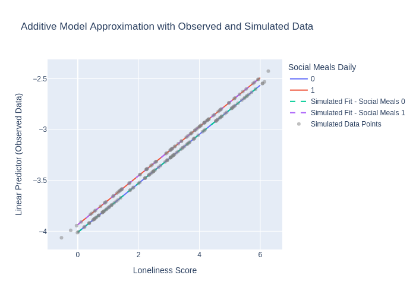
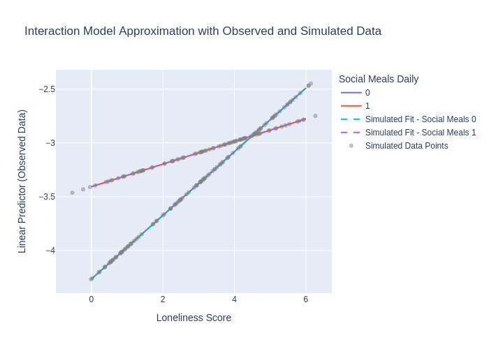

# Logistic Regression Models and Analysis

In this analysis, we aim to predict the presence of binge eating disorder based on loneliness scores and social meal frequency. We build two logistic regression models: one additive (without interaction) and one including an interaction term.

**Variables:**

- **Outcome Variable:**
  - **Binge Eating Disorder (binary):**
    - **1**: "At least once a week"
    - **0**: "Rarely", "Never", "Sometimes"

- **Predictor Variables:**
  - **Loneliness Score (Continuous):**
    - `LONELY_dejong_emotional_social_loneliness_scale_score`
  - **Social Meals Frequency (Binary):**
    - **1**: Eating meals with others **at least once a day**
    - **0**: Eating meals with others **less than once a day**

**Data Preparation:**

- **Mapping the Outcome Variable:**
  - Converted the binge eating frequency responses to a binary variable where "At least once a week" is mapped to 1 (indicating binge eating disorder), and all other responses are mapped to 0.

- **Mapping the Predictor Variable (Social Meals Frequency):**
  - **Categories Mapped to 1 (At least once a day):**
    - "1 time per day"
    - "2 to 3 times per day"
  - **Categories Mapped to 0 (Less than once a day):**
    - "Never"
    - "1 time last month"
    - "2 to 3 times last month"
    - "1 time per week"
    - "2 times per week"
    - "3 to 4 times per week"
    - "5 to 6 times per week"
  - This mapping accurately represents individuals who eat meals with others at least once a day versus those who do so less frequently.

- **Handling Missing Values:**
  - Dropped rows with missing values in the outcome or predictor variables to ensure the integrity of the analysis.

**Model Building:**

1. **Additive Model (No Interaction):**

   - **Formula:**
     \[
     $\text{binge\_eating\_disorder}$ = $\beta_0$ + $\beta_1 \$times $\text{loneliness\_score} $+ $\beta_2 \$times $\text{social\_meals\_daily}$
     \]
   - **Interpretation:**
     - The effect of loneliness on binge eating disorder is the same regardless of social meal frequency.

2. **Interaction Model (With Interaction):**

   - **Formula:**
     \[
     \text{binge\_eating\_disorder} = \beta_0 + \beta_1 \times \text{loneliness\_score} + \beta_2 \times \text{social\_meals\_daily} + \beta_3 \times (\text{loneliness\_score} \times \text{social\_meals\_daily})
     \]
   - **Interpretation:**
     - The effect of loneliness on binge eating disorder varies depending on social meal frequency.

**Model Summaries:**

- Examined the coefficients, standard errors, z-values, and p-values to evaluate the significance of the predictors and the interaction term.

**Likelihood Ratio Test:**

- Compared the additive and interaction models to assess if the interaction term significantly improves the model fit.

**Predictions and Visualization:**

- Generated predicted probabilities across the range of loneliness scores for both levels of social meal frequency.
- Plotted the predicted probabilities for both models to visualize the relationships.


```python
# Import Libraries
import pandas as pd
import statsmodels.formula.api as smf
import numpy as np
import plotly.express as px
from scipy import stats

# Load the data
data_url = "https://raw.githubusercontent.com/pointOfive/stat130chat130/main/CP/CSCS_data_anon.csv"
data = pd.read_csv(data_url, na_values=["9999", "", " ", "Presented but no response", "NA"])

# Keep only the columns we're interested in
columns_to_keep = [
    'NUTRITION_three_factor_eating_questionnaire_binge_eating_when_not_hungry',
    'LONELY_dejong_emotional_social_loneliness_scale_score',
    'NUTRITION_canadian_food_intake_screener_frequency_social_meals'
]
data = data[columns_to_keep]

# Prepare the Outcome Variable
# Map the outcome variable to binary
data['binge_eating_disorder'] = data['NUTRITION_three_factor_eating_questionnaire_binge_eating_when_not_hungry'].map({
    'At least once a week': 1,
    'Rarely': 0,
    'Never': 0,
    'Sometimes': 0
})

# Drop rows with missing outcome values
data = data.dropna(subset=['binge_eating_disorder'])

# Prepare the Predictor Variables
# Drop rows with missing loneliness scores
data = data.dropna(subset=['LONELY_dejong_emotional_social_loneliness_scale_score'])

# Define categories that represent eating meals with others at least once a day
daily_meals = ["1 time per day", "2 to 3 times per day"]

# Map the predictor variable to binary
def map_social_meals(value):
    if value in daily_meals:
        return 1
    elif pd.isna(value):
        return np.nan  # Keep NaN values to drop them later
    else:
        return 0

data['social_meals_daily'] = data['NUTRITION_canadian_food_intake_screener_frequency_social_meals'].apply(map_social_meals)

# Drop rows with missing predictor values
data = data.dropna(subset=['social_meals_daily'])

# Build the Logistic Regression Models
# Model 1: Additive Model (No Interaction)
formula_additive = 'binge_eating_disorder ~ LONELY_dejong_emotional_social_loneliness_scale_score + social_meals_daily'
model_additive = smf.logit(formula=formula_additive, data=data).fit()
print("Additive Model Summary:")
print(model_additive.summary())

# Model 2: Interaction Model (With Interaction)
formula_interaction = 'binge_eating_disorder ~ LONELY_dejong_emotional_social_loneliness_scale_score * social_meals_daily'
model_interaction = smf.logit(formula=formula_interaction, data=data).fit()
print("\nInteraction Model Summary:")
print(model_interaction.summary())

# Likelihood Ratio Test to assess the necessity of the interaction term
lr_stat = 2 * (model_interaction.llf - model_additive.llf)
p_value = stats.chi2.sf(lr_stat, df=1)  # df=1 because the interaction model has one additional parameter
print(f"\nLikelihood Ratio Test Statistic: {lr_stat:.4f}")
print(f"P-value: {p_value:.4f}")

# Visualization including lines fitted to observed data and simulated data

def plot_with_simulated_data(model, model_name):
    # Extract coefficients
    params = model.params
    intercept = params['Intercept']
    predictors = params.index.drop('Intercept')
    
    # Create a range of values for the continuous predictor
    loneliness_values = np.linspace(data['LONELY_dejong_emotional_social_loneliness_scale_score'].min(),
                                    data['LONELY_dejong_emotional_social_loneliness_scale_score'].max(), 100)
    
    # Prepare data for both levels of the binary predictor
    plot_data = pd.DataFrame({
        'LONELY_dejong_emotional_social_loneliness_scale_score': np.concatenate([loneliness_values, loneliness_values]),
        'social_meals_daily': [0]*100 + [1]*100
    })
    
    # Calculate the linear predictor (log-odds) for observed data
    if 'LONELY_dejong_emotional_social_loneliness_scale_score:social_meals_daily' in predictors:
        coef_loneliness = params['LONELY_dejong_emotional_social_loneliness_scale_score']
        coef_social_meals = params['social_meals_daily']
        coef_interaction = params['LONELY_dejong_emotional_social_loneliness_scale_score:social_meals_daily']
        
        plot_data['linear_pred_observed'] = (
            intercept
            + coef_loneliness * plot_data['LONELY_dejong_emotional_social_loneliness_scale_score']
            + coef_social_meals * plot_data['social_meals_daily']
            + coef_interaction * plot_data['LONELY_dejong_emotional_social_loneliness_scale_score'] * plot_data['social_meals_daily']
        )
    else:
        coef_loneliness = params['LONELY_dejong_emotional_social_loneliness_scale_score']
        coef_social_meals = params['social_meals_daily']
        
        plot_data['linear_pred_observed'] = (
            intercept
            + coef_loneliness * plot_data['LONELY_dejong_emotional_social_loneliness_scale_score']
            + coef_social_meals * plot_data['social_meals_daily']
        )
    
    # Simulate random noise and generate simulated data points
    np.random.seed(0)
    num_points = 200
    loneliness_sim = np.random.uniform(data['LONELY_dejong_emotional_social_loneliness_scale_score'].min(),
                                       data['LONELY_dejong_emotional_social_loneliness_scale_score'].max(), num_points)
    loneliness_sim += np.random.normal(0, 0.5, num_points)  # Add noise
    
    # Assign random values for the binary predictor
    social_meals_sim = np.random.choice([0, 1], size=num_points)
    
    # Simulate outcome variable using the same model coefficients
    sim_data = pd.DataFrame({
        'LONELY_dejong_emotional_social_loneliness_scale_score': loneliness_sim,
        'social_meals_daily': social_meals_sim
    })
    
    # Compute the linear predictor for simulated data
    if 'LONELY_dejong_emotional_social_loneliness_scale_score:social_meals_daily' in predictors:
        sim_data['linear_pred_simulated'] = (
            intercept
            + coef_loneliness * sim_data['LONELY_dejong_emotional_social_loneliness_scale_score']
            + coef_social_meals * sim_data['social_meals_daily']
            + coef_interaction * sim_data['LONELY_dejong_emotional_social_loneliness_scale_score'] * sim_data['social_meals_daily']
        )
    else:
        sim_data['linear_pred_simulated'] = (
            intercept
            + coef_loneliness * sim_data['LONELY_dejong_emotional_social_loneliness_scale_score']
            + coef_social_meals * sim_data['social_meals_daily']
        )
    
    # Fit a new model to the simulated data
    sim_data['binge_eating_disorder'] = sim_data['linear_pred_simulated']  # Since we're approximating linear regression
    sim_model = smf.ols(formula='binge_eating_disorder ~ LONELY_dejong_emotional_social_loneliness_scale_score * social_meals_daily', data=sim_data).fit()
    
    # Extract coefficients from the simulated model
    sim_params = sim_model.params
    sim_intercept = sim_params['Intercept']
    sim_predictors = sim_params.index.drop('Intercept')
    
    # Calculate the linear predictor for the simulated model
    plot_data['linear_pred_simulated'] = None  # Initialize the column
    
    if 'LONELY_dejong_emotional_social_loneliness_scale_score:social_meals_daily' in sim_predictors:
        sim_coef_loneliness = sim_params['LONELY_dejong_emotional_social_loneliness_scale_score']
        sim_coef_social_meals = sim_params['social_meals_daily']
        sim_coef_interaction = sim_params['LONELY_dejong_emotional_social_loneliness_scale_score:social_meals_daily']
        
        plot_data['linear_pred_simulated'] = (
            sim_intercept
            + sim_coef_loneliness * plot_data['LONELY_dejong_emotional_social_loneliness_scale_score']
            + sim_coef_social_meals * plot_data['social_meals_daily']
            + sim_coef_interaction * plot_data['LONELY_dejong_emotional_social_loneliness_scale_score'] * plot_data['social_meals_daily']
        )
    else:
        sim_coef_loneliness = sim_params['LONELY_dejong_emotional_social_loneliness_scale_score']
        sim_coef_social_meals = sim_params['social_meals_daily']
        
        plot_data['linear_pred_simulated'] = (
            sim_intercept
            + sim_coef_loneliness * plot_data['LONELY_dejong_emotional_social_loneliness_scale_score']
            + sim_coef_social_meals * plot_data['social_meals_daily']
        )
    
    # Visualization
    # Plot the best fit lines for observed data
    fig = px.line(
        plot_data,
        x='LONELY_dejong_emotional_social_loneliness_scale_score',
        y='linear_pred_observed',
        color='social_meals_daily',
        labels={
            'LONELY_dejong_emotional_social_loneliness_scale_score': 'Loneliness Score',
            'linear_pred_observed': 'Linear Predictor (Observed Data)',
            'social_meals_daily': 'Social Meals Daily'
        },
        title=f'{model_name} Approximation with Observed and Simulated Data'
    )
    
    # Plot the best fit lines for simulated data
    for meal_freq in [0, 1]:
        subset = plot_data[plot_data['social_meals_daily'] == meal_freq]
        fig.add_scatter(
            x=subset['LONELY_dejong_emotional_social_loneliness_scale_score'],
            y=subset['linear_pred_simulated'],
            mode='lines',
            name=f'Simulated Fit - Social Meals {meal_freq}',
            line=dict(dash='dash')
        )
    
    # Add simulated data points
    fig.add_scatter(
        x=sim_data['LONELY_dejong_emotional_social_loneliness_scale_score'],
        y=sim_data['binge_eating_disorder'],
        mode='markers',
        marker=dict(color='grey', opacity=0.5),
        name='Simulated Data Points'
    )
    
    fig.show(renderer='png')
    
    return sim_data

# Plot for the additive model
plot_with_simulated_data(model_additive, 'Additive Model')

# Plot for the interaction model
sim_data=plot_with_simulated_data(model_interaction, 'Interaction Model')

print(model_interaction.predict(sim_data))
```

    /tmp/ipykernel_470/4022562607.py:10: DtypeWarning: Columns (129,408,630,671,689,978,1001,1002,1006,1007,1008,1080,1113,1115,1116,1117,1118,1119,1120,1121,1124,1125,1126,1127,1128,1213,1214,1215,1216,1217,1218,1263,1266,1342,1343,1344,1345,1346,1347,1348,1349,1390,1391,1393,1439,1442,1463,1546,1549,1552,1555,1558,1561) have mixed types. Specify dtype option on import or set low_memory=False.
      data = pd.read_csv(data_url, na_values=["9999", "", " ", "Presented but no response", "NA"])


    Optimization terminated successfully.
             Current function value: 0.186299
             Iterations 8
    Additive Model Summary:
                                 Logit Regression Results                            
    =================================================================================
    Dep. Variable:     binge_eating_disorder   No. Observations:                  296
    Model:                             Logit   Df Residuals:                      293
    Method:                              MLE   Df Model:                            2
    Date:                   Fri, 15 Nov 2024   Pseudo R-squ.:                 0.02194
    Time:                           01:46:02   Log-Likelihood:                -55.145
    converged:                          True   LL-Null:                       -56.382
    Covariance Type:               nonrobust   LLR p-value:                    0.2902
    =========================================================================================================================
                                                                coef    std err          z      P>|z|      [0.025      0.975]
    -------------------------------------------------------------------------------------------------------------------------
    Intercept                                                -4.0106      0.801     -5.007      0.000      -5.581      -2.441
    LONELY_dejong_emotional_social_loneliness_scale_score     0.2409      0.162      1.489      0.137      -0.076       0.558
    social_meals_daily                                        0.0753      0.674      0.112      0.911      -1.245       1.396
    =========================================================================================================================
    Optimization terminated successfully.
             Current function value: 0.185815
             Iterations 8
    
    Interaction Model Summary:
                                 Logit Regression Results                            
    =================================================================================
    Dep. Variable:     binge_eating_disorder   No. Observations:                  296
    Model:                             Logit   Df Residuals:                      292
    Method:                              MLE   Df Model:                            3
    Date:                   Fri, 15 Nov 2024   Pseudo R-squ.:                 0.02449
    Time:                           01:46:02   Log-Likelihood:                -55.001
    converged:                          True   LL-Null:                       -56.382
    Covariance Type:               nonrobust   LLR p-value:                    0.4299
    ============================================================================================================================================
                                                                                   coef    std err          z      P>|z|      [0.025      0.975]
    --------------------------------------------------------------------------------------------------------------------------------------------
    Intercept                                                                   -4.2648      0.975     -4.376      0.000      -6.175      -2.354
    LONELY_dejong_emotional_social_loneliness_scale_score                        0.2958      0.197      1.503      0.133      -0.090       0.682
    social_meals_daily                                                           0.8582      1.561      0.550      0.582      -2.201       3.917
    LONELY_dejong_emotional_social_loneliness_scale_score:social_meals_daily    -0.1908      0.352     -0.542      0.588      -0.881       0.500
    ============================================================================================================================================
    
    Likelihood Ratio Test Statistic: 0.2869
    P-value: 0.5922


    

    


    

    


    0      0.047358
    1      0.046862
    2      0.033421
    3      0.033493
    4      0.040477
             ...   
    195    0.026420
    196    0.039485
    197    0.036178
    198    0.013950
    199    0.027365
    Length: 200, dtype: float64


### Additive Model (Without Interaction)
**Key Results:**

- **Coefficients and P-values:**

  | Variable                                                 | Coefficient | P-value |
  |----------------------------------------------------------|-------------|---------|
  | Intercept                                                | -4.0106     | 0.000   |
  | Loneliness Score                                         | 0.2409      | 0.137   |
  | Social Meals Daily                                       | 0.0753      | 0.911   |

**Interpretation:**

- **Intercept (-4.0106, p = 0.000):**
  - Statistically significant (p < 0.05).
  - Represents the baseline log-odds of having a binge eating disorder when both loneliness score and social meals frequency are zero.

- **Loneliness Score (0.2409, p = 0.137):**
  - **Not statistically significant** (p = 0.137 > 0.05).
  - Suggests that as loneliness increases, the odds of binge eating disorder may increase, but there is insufficient evidence to confirm this relationship.

- **Social Meals Daily (0.0753, p = 0.911):**
  - **Not statistically significant** (p = 0.911 > 0.05).
  - Indicates that eating meals with others at least once a day does not have a significant effect on the odds of binge eating disorder.

**Conclusion for Additive Model:**

- Neither loneliness score nor social meals frequency are significant predictors of binge eating disorder in this model.
- The statistical evidence does not support a strong relationship between these predictors and the outcome.

---

### Interaction Model (With Interaction)

**Key Results:**

- **Coefficients and P-values:**

  | Variable                                                 | Coefficient | P-value |
  |----------------------------------------------------------|-------------|---------|
  | Intercept                                                | -4.2648     | 0.000   |
  | Loneliness Score                                         | 0.2958      | 0.133   |
  | Social Meals Daily                                       | 0.8582      | 0.582   |
  | Loneliness Score × Social Meals Daily                    | -0.1908     | 0.588   |

**Interpretation:**

- **Intercept (-4.2648, p = 0.000):**
  - Statistically significant (p < 0.05).
  - Represents the baseline log-odds when both predictors are zero.

- **Loneliness Score (0.2958, p = 0.133):**
  - **Not statistically significant** (p = 0.133 > 0.05).
  - Suggests a potential positive association with binge eating disorder, but evidence is insufficient.

- **Social Meals Daily (0.8582, p = 0.582):**
  - **Not statistically significant** (p = 0.582 > 0.05).
  - No significant effect on the odds of binge eating disorder.

- **Interaction Term (-0.1908, p = 0.588):**
  - **Not statistically significant** (p = 0.588 > 0.05).
  - Indicates that the effect of loneliness on binge eating disorder does not significantly change based on social meals frequency.

**Conclusion for Interaction Model:**

- None of the predictors, including the interaction term, are statistically significant.
- The inclusion of the interaction term does not provide a significant improvement over the additive model.

---

### Model Comparison and Final Interpretation

**Likelihood Ratio Test:**

- **Test Statistic:** 0.2869
- **P-value:** 0.5922

**Interpretation:**

- The p-value (0.5922) is greater than 0.05, indicating that adding the interaction term does not significantly improve the model.
- The simpler additive model is preferred due to its parsimony.


```python

```
